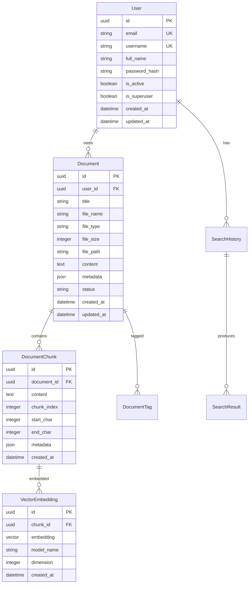

# Shrimp Agent V2 架构文档

## 概述

Shrimp Agent V2 是一个现代化的智能搜索与文档管理平台，采用微服务架构设计，提供高性能的语义搜索、文档处理和智能问答功能。

## 系统架构

### 整体架构图

```
┌─────────────────────────────────────────────────────────────────┐
│                        前端层 (Frontend)                        │
├─────────────────────────────────────────────────────────────────┤
│  React + TypeScript + Vite + Tailwind CSS + Zustand           │
│  - 用户界面组件                                                  │
│  - 状态管理                                                     │
│  - 路由管理                                                     │
│  - API 客户端                                                   │
└─────────────────────────────────────────────────────────────────┘
                                  │
                                  │ HTTP/WebSocket
                                  ▼
┌─────────────────────────────────────────────────────────────────┐
│                        API 网关层                               │
├─────────────────────────────────────────────────────────────────┤
│  FastAPI + Uvicorn                                             │
│  - 请求路由                                                     │
│  - 认证授权                                                     │
│  - 限流控制                                                     │
│  - 请求验证                                                     │
└─────────────────────────────────────────────────────────────────┘
                                  │
                                  ▼
┌─────────────────────────────────────────────────────────────────┐
│                        业务逻辑层                               │
├─────────────────────────────────────────────────────────────────┤
│  ┌─────────────┐  ┌─────────────┐  ┌─────────────┐              │
│  │ 智能体引擎   │  │ RAG 引擎    │  │ 文档处理器   │              │
│  │ - 插件系统   │  │ - 向量搜索   │  │ - 文件解析   │              │
│  │ - 任务调度   │  │ - 语义检索   │  │ - 内容提取   │              │
│  │ - 工作流     │  │ - 上下文生成 │  │ - 格式转换   │              │
│  └─────────────┘  └─────────────┘  └─────────────┘              │
│                                                                 │
│  ┌─────────────┐  ┌─────────────┐  ┌─────────────┐              │
│  │ LLM 抽象层  │  │ 搜索引擎     │  │ 用户管理     │              │
│  │ - 多模型支持 │  │ - 多策略搜索 │  │ - 认证授权   │              │
│  │ - 统一接口   │  │ - 结果排序   │  │ - 权限控制   │              │
│  │ - 负载均衡   │  │ - 缓存优化   │  │ - 用户偏好   │              │
│  └─────────────┘  └─────────────┘  └─────────────┘              │
└─────────────────────────────────────────────────────────────────┘
                                  │
                                  ▼
┌─────────────────────────────────────────────────────────────────┐
│                        数据访问层                               │
├─────────────────────────────────────────────────────────────────┤
│  SQLAlchemy ORM + Alembic                                      │
│  - 数据模型定义                                                  │
│  - 数据库迁移                                                   │
│  - 连接池管理                                                   │
│  - 事务管理                                                     │
└─────────────────────────────────────────────────────────────────┘
                                  │
                                  ▼
┌─────────────────────────────────────────────────────────────────┐
│                        存储层                                   │
├─────────────────────────────────────────────────────────────────┤
│  ┌─────────────┐  ┌─────────────┐  ┌─────────────┐              │
│  │ PostgreSQL  │  │ Redis       │  │ 向量数据库   │              │
│  │ - 关系数据   │  │ - 缓存      │  │ - FAISS     │              │
│  │ - 元数据     │  │ - 会话      │  │ - Chroma    │              │
│  │ - 用户数据   │  │ - 队列      │  │ - 向量索引   │              │
│  └─────────────┘  └─────────────┘  └─────────────┘              │
└─────────────────────────────────────────────────────────────────┘
```

## 核心模块

### 1. 智能体引擎 (Agent Engine)

**职责**：
- 插件化架构管理
- 任务调度和执行
- 工作流编排
- 智能体生命周期管理

**核心组件**：
```python
# app/core/agent/
├── engine.py          # 智能体引擎核心
├── plugin_manager.py  # 插件管理器
├── task_scheduler.py  # 任务调度器
├── workflow.py        # 工作流引擎
└── plugins/           # 插件目录
    ├── search_plugin.py
    ├── document_plugin.py
    └── llm_plugin.py
```

**设计模式**：
- 插件模式：支持动态加载和卸载插件
- 观察者模式：事件驱动的任务执行
- 策略模式：多种执行策略

### 2. LLM 抽象层 (LLM Abstraction Layer)

**职责**：
- 统一多个 LLM 提供商的接口
- 负载均衡和故障转移
- 请求缓存和优化
- 成本控制和监控

**支持的模型**：
- OpenAI GPT 系列
- Anthropic Claude
- Google Gemini
- 本地模型（通过 OpenRouter）

**核心组件**：
```python
# app/core/llm/
├── base.py           # 抽象基类
├── openai_client.py  # OpenAI 客户端
├── claude_client.py  # Claude 客户端
├── gemini_client.py  # Gemini 客户端
├── router.py         # 路由和负载均衡
└── cache.py          # 缓存管理
```

### 3. RAG 引擎 (RAG Engine)

**职责**：
- 文档向量化和索引
- 语义相似度搜索
- 上下文检索和生成
- 多模态内容处理

**核心流程**：
1. **文档摄取**：解析、分块、向量化
2. **检索**：语义搜索、重排序
3. **生成**：上下文注入、答案生成
4. **后处理**：结果验证、格式化

**核心组件**：
```python
# app/core/rag/
├── engine.py         # RAG 引擎核心
├── retriever.py      # 检索器
├── generator.py      # 生成器
├── embeddings.py     # 向量化
├── reranker.py       # 重排序
└── vector_store.py   # 向量存储
```

### 4. 文档处理器 (Document Processor)

**职责**：
- 多格式文档解析
- 内容提取和清理
- 智能分块
- 元数据提取

**支持格式**：
- PDF、Word、Excel、PowerPoint
- HTML、Markdown、纯文本
- 图片（OCR）
- 音频、视频（转录）

**核心组件**：
```python
# app/services/document/
├── processor.py      # 文档处理器
├── parsers/          # 解析器
│   ├── pdf_parser.py
│   ├── word_parser.py
│   └── html_parser.py
├── chunker.py        # 分块器
└── metadata.py       # 元数据提取
```

## 数据模型

### 核心实体关系



## API 设计

### RESTful API 结构

```
/api/v1/
├── auth/                 # 认证相关
│   ├── POST /login
│   ├── POST /register
│   ├── POST /refresh
│   └── POST /logout
├── users/                # 用户管理
│   ├── GET /me
│   ├── PUT /me
│   └── DELETE /me
├── documents/            # 文档管理
│   ├── GET /
│   ├── POST /
│   ├── GET /{id}
│   ├── PUT /{id}
│   ├── DELETE /{id}
│   └── POST /{id}/process
├── search/               # 搜索功能
│   ├── POST /documents
│   ├── GET /suggestions
│   ├── GET /history
│   └── DELETE /history
├── chat/                 # 智能问答
│   ├── POST /
│   ├── GET /history
│   └── WebSocket /stream
└── admin/                # 管理功能
    ├── GET /stats
    ├── GET /users
    └── GET /system
```

### WebSocket API

```
/ws/
├── chat/{session_id}     # 实时聊天
├── search/{session_id}   # 实时搜索
└── notifications         # 系统通知
```

## 安全架构

### 认证和授权

1. **JWT 认证**：
   - Access Token（短期，15分钟）
   - Refresh Token（长期，7天）
   - 自动刷新机制

2. **权限控制**：
   - 基于角色的访问控制（RBAC）
   - 资源级权限
   - API 级限流

3. **数据安全**：
   - 数据加密（传输和存储）
   - 敏感信息脱敏
   - 审计日志

### 安全措施

```python
# 安全配置示例
SECURITY_CONFIG = {
    "password_policy": {
        "min_length": 8,
        "require_uppercase": True,
        "require_lowercase": True,
        "require_numbers": True,
        "require_special_chars": True
    },
    "rate_limiting": {
        "api_calls": "100/minute",
        "login_attempts": "5/minute",
        "search_requests": "50/minute"
    },
    "cors": {
        "allowed_origins": ["https://app.example.com"],
        "allowed_methods": ["GET", "POST", "PUT", "DELETE"],
        "allowed_headers": ["Authorization", "Content-Type"]
    }
}
```

## 性能优化

### 缓存策略

1. **多层缓存**：
   - L1: 应用内存缓存
   - L2: Redis 分布式缓存
   - L3: CDN 边缘缓存

2. **缓存策略**：
   - 搜索结果缓存（TTL: 1小时）
   - 用户会话缓存（TTL: 24小时）
   - 文档元数据缓存（TTL: 7天）

### 数据库优化

1. **索引策略**：
   - 主键索引
   - 外键索引
   - 复合索引
   - 全文搜索索引

2. **查询优化**：
   - 连接池管理
   - 预编译语句
   - 批量操作
   - 分页查询

### 向量搜索优化

1. **索引优化**：
   - HNSW 索引
   - 量化压缩
   - 分片策略

2. **检索优化**：
   - 近似最近邻搜索
   - 预过滤
   - 并行检索

## 监控和可观测性

### 指标监控

```python
# 关键指标
METRICS = {
    "business": {
        "search_requests_total": "搜索请求总数",
        "document_uploads_total": "文档上传总数",
        "user_registrations_total": "用户注册总数",
        "search_response_time": "搜索响应时间",
        "search_accuracy": "搜索准确率"
    },
    "technical": {
        "api_requests_total": "API 请求总数",
        "api_response_time": "API 响应时间",
        "database_connections": "数据库连接数",
        "memory_usage": "内存使用率",
        "cpu_usage": "CPU 使用率"
    },
    "errors": {
        "error_rate": "错误率",
        "timeout_rate": "超时率",
        "5xx_errors": "服务器错误数",
        "4xx_errors": "客户端错误数"
    }
}
```

### 日志管理

1. **结构化日志**：
   - JSON 格式
   - 统一字段
   - 链路追踪

2. **日志级别**：
   - ERROR: 错误信息
   - WARN: 警告信息
   - INFO: 一般信息
   - DEBUG: 调试信息

3. **日志聚合**：
   - ELK Stack
   - 日志分析
   - 告警机制

## 部署架构

### 容器化部署

```yaml
# docker-compose.yml 结构
services:
  app:           # 主应用
  postgres:      # 数据库
  redis:         # 缓存
  nginx:         # 反向代理
  prometheus:    # 监控
  grafana:       # 可视化
  elasticsearch: # 日志搜索
  kibana:        # 日志分析
```

### 扩展策略

1. **水平扩展**：
   - 应用服务多实例
   - 负载均衡
   - 数据库读写分离

2. **垂直扩展**：
   - 资源配置优化
   - 性能调优
   - 硬件升级

## 开发规范

### 代码规范

1. **Python 后端**：
   - PEP 8 代码风格
   - Type Hints
   - Docstring 文档
   - 单元测试覆盖率 > 80%

2. **TypeScript 前端**：
   - ESLint + Prettier
   - 组件化设计
   - Props 类型定义
   - 测试驱动开发

### Git 工作流

```
main
├── develop
│   ├── feature/search-optimization
│   ├── feature/document-processing
│   └── feature/user-management
├── release/v2.1.0
└── hotfix/security-patch
```

### CI/CD 流程

1. **持续集成**：
   - 代码检查
   - 单元测试
   - 集成测试
   - 安全扫描

2. **持续部署**：
   - 自动构建
   - 环境部署
   - 健康检查
   - 回滚机制

## 技术选型理由

### 后端技术栈

- **FastAPI**：高性能、自动文档生成、类型安全
- **SQLAlchemy**：ORM 功能强大、支持异步
- **PostgreSQL**：ACID 特性、JSON 支持、全文搜索
- **Redis**：高性能缓存、丰富数据结构
- **FAISS/Chroma**：向量搜索性能优异

### 前端技术栈

- **React**：组件化、生态丰富、性能优秀
- **TypeScript**：类型安全、开发体验好
- **Vite**：构建速度快、开发体验好
- **Tailwind CSS**：原子化 CSS、定制性强
- **Zustand**：轻量级状态管理

## 未来规划

### 短期目标（3个月）

1. 完善核心功能
2. 性能优化
3. 安全加固
4. 用户体验优化

### 中期目标（6个月）

1. 多模态搜索
2. 智能推荐
3. 协作功能
4. 移动端支持

### 长期目标（12个月）

1. 企业级功能
2. 私有化部署
3. 开放 API 平台
4. 生态系统建设

---

本文档将随着系统的发展持续更新，确保架构设计与实际实现保持一致。